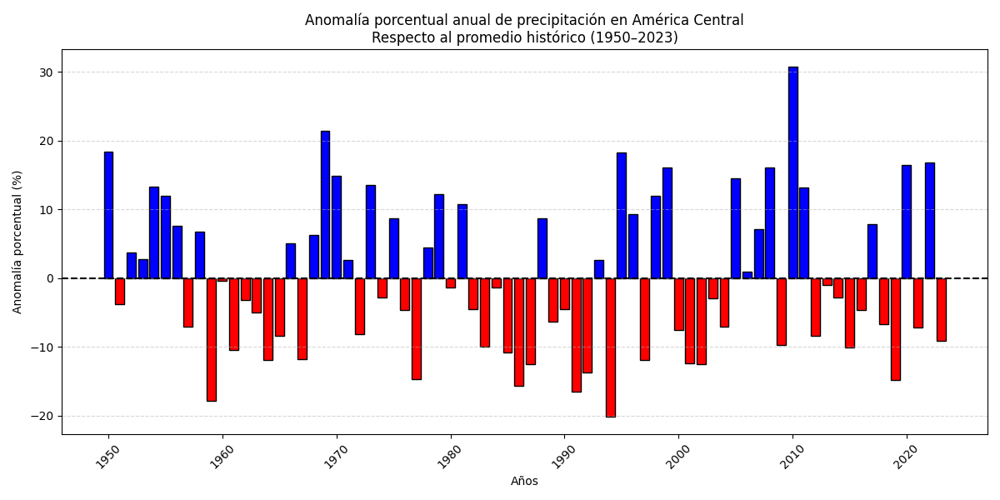
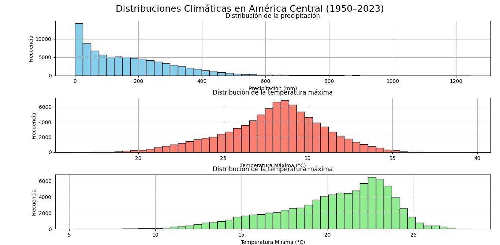
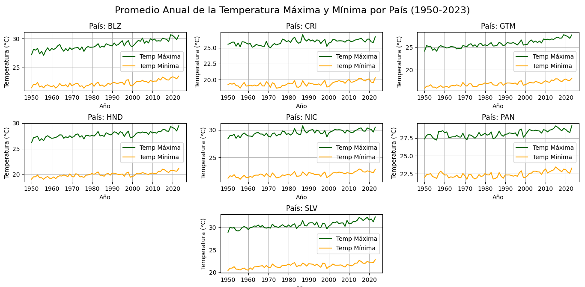
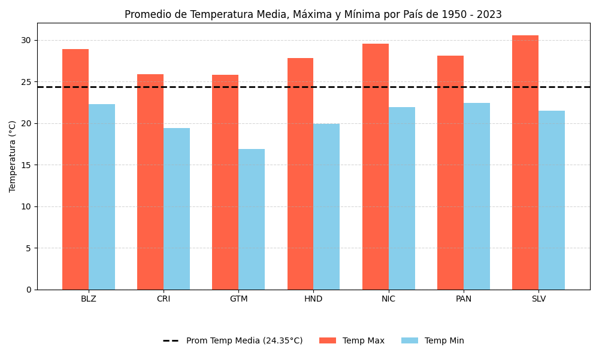

#  Tema: Análisis de datos climatológicos de Precipitación y Temperatura, región de América Central en el periodo de 1950-2023.   
## Estudiantes: Silvia María Cerdas Mora y Ana Isabel Valverde Gardela  

## *Preguntas para responder*  

1. ¿Existe una modificación en las precipitaciones, de América Central, para el periodo seleccionado? 

2. ¿Cuál es el comportamiento de los promedios de la temperatura, en cada país para el periodo de 1950-2023? 

3. ¿Se evidencia una tendencia de aumento de la temperatura mínima  con respecto a la máxima?, se puede asociar al Cambio Climático? 

4. ¿Cuál año presenta mayor modificación de las variables, se debió a la influencia de algún fenómeno meteorológico asociado, para la región de América Central?

## *Hipótesis iniciales*
Cambio marcado entre los valores de las precipitaciones sobre la región seleccionada debido a los cambios climatológicos de la región. 
  
Mayor impacto sobre la región a durante la presencia de eventos extremos del ENOS, tanto en su fase fría como cálida, afectando se distinta forma la vertiente del Caribe centroamericana, como la vertiente del Pacífico de América Central.  
Presencia de una correlación positiva entre el ENOS y las variables de estudio.  

Presencia de anomalías de las precipitaciones y temperaturas. 

## *Visualizaciones planteadas*   

1. Gráfico lineal con el fin de visualizar la tendencia de la temperatura promedio anual de los 7 países en el periodo seleccionado.  

2. Gráfico lineal con el fin de visualizar la tendencia de la precipitación anual de los 7 países en el periodo seleccionado. 

3. Histograma de la variable de precipitación. 

4. Gráfico de barras para la visualización de las anomalías de precipitación. 

5. Gráfico lineal para la dinámica de época lluviosa y seca en cada país.

## *Metodología* 
*Datos Utilizados: URL: https://climateknowledgeportal.worldbank.org/. de:*

1. Precipitación (mm) 
2. Temperatura máxima (°C) 
3. Temperatura mínima (°C)

Los archivos descargados del ERA5 son en formato excel y además las columnas corresponden a las fechas, por lo cual se transpusieron los datos mediante un código de python y se convirtió a csv (se agregará a anexos), se crearon dos archivos, uno que contiene las temperaturas máximas y mínimas y otro con los datos de precipitación. Entonces ahora el archivo va contener las siguientes columnas:
1. code: código de la estación
2. name: nombre del lugar
3. year: año del dato
4. month: mes del dato
5. temp_min, temp_max / precip

Por medio de la creación de un código en Python y usando Visual Studio Code, se va a crear un código para la visualización y graficación de los datos. Las visualizaciones serán claves para poder responder las preguntas planteadas, sin embargo, es de manera clave la búsqueda y lectura de distintos artículos científicos, con el fin de clarificar y relacionar eventos ENOS con los posibles cambios de los valores y con esto el análisis de la dinámica de América Central de las precipitaciones y temperaturas, como estas se encuentran relacionado a los agentes externos (fenómenos meteorológicos). 

## *Resultados y Análisis*

De acuerdo con la gráfica de las anomalias, los valores de promedios de la precipitación no es constante, estos evidencian cambios, los cuales evidencian cambios entre los patrones a lo largo dle periodo establecido, ya sean la procencia de anomalías positivas como negativas. 

El gráfico de distribución climática muestra las distribuciones de la precipitación, temperatura máxima y temperatura mínima para el periodo 1950-2023. Para la gráfica de precipitación, se puede notar que los datos con mayor frecuencia se localizan entre 0 y 100 mm, esto indica que en la mayoría de los meses la lluvia que se registró es baja. Sin embargo, existen eventos de lluvia intensa, aunque menos frecuentes. Para la gráfica de temperatura máxima se logra observar que la distribución es más hacia el centro, lo que señala que las temperaturas máximas son relativamente estables y poseen pocas variaciones extremas. Ahora bien, para la gráfica de temperatura mínima los datos se concentran entre 20 y 23 °C, indicando temperaturas frescas y al igual que las máximas, se muestran pocos valores extremos.

De acuerdo con las gráfica de promedio de precipitación, los paises centroamericanos presentan patrones similares. Sin embargo se obterva una diferencia marcada de un aumento en el valor de la sprecipitaciones de Costa Rcia y Panamá

## *Ejemplos*
### Caso 1: 2010 (Fenómeno de La niña)
El año 2010 muestra una particularidad, ya que al iniciar este se encontraba en la fase cálida. A medida que fue avanzando el año, el índice ONI disminuyó, lo que indicaba que la fase de La Niña se estaba activando (NOAA, s.f).

La Niña aumenta la actividad de ciclones en la cuenca del Atlántico, siendo que en el 2010 la frecuencia de ciclones tropicales tuvo un aumento. Igor fue el huracán más intenso, aunque sólo causó daños mínimos en la isla de las Bermudas. Por otro lado, en Costa Rica, el tránsito de ciclones por el mar Caribe, ocasionaron lluvias intensas en el Valle Central y el Pacífico Central. Se consideró este evento como uno de los más intensos en los últimos 30 años (Instituto Meteorológico Nacional, 2010) 

### Caso 2: 2019 (Fenómeno de El Niño)
Otro ejemplo es el caso 2,  para este año se da la presencia del Fenómeno de El Niño sobre América Central, afectando directamente las precipitaciones de los paises de la región. Presentando una disminución marcada en los valores promedios, como es el caso de dos dos paises: Belice y Costa Rica.

Belice, preecenta afectaciones marcadas dentro de su sector agro, se de la presenia por parte del Ministerio de agricultura sobre dicho tema mediente comunicados de prensa sobre la sequia. 
El servicio Meteorologíco  establece a el Niño como un impulsador climatologico, como se estableció para el año 2019, evidenciando una disminución de las precipitaciones en relacion con los valores normales (Ministerio de Agricultura de Belice, s.f.).

Para el 2019, en el caso de Costa Rica, se establece la disminución de las precipitaciones, de acuerdo con el informe 10 del Boletín del ENOS del IMN.
En el cual evidencia que desde noviembre del año 2018 tanto para la región centroamericana, como para la región del Mar Caribe se dan valores positivos de la anomalia, de acuerdo con el estudio de stacione y estimadores de lluvia las zonas con mayor afectación son: la Vertiente del Caribe, como la Zona Norte (donde se presentó una sequía meterologíca). Estableciendo porcentajes de lluvia menores al 55% en todo el pais de los valores normales (Instituto Meteorológico Nacional, 2019).

De acuerdo con información del portal "Ojo del Clima", el porcentaje  de disminución alcanzó un 20% del total de lluvias para el año del 2019. De acuerdo con información suminstrada por el dirctor interino del IMN, el señor Werner Stolz: región del Valle Central y Pacífico el porcentaje es de 15-20% y Caribe un superavir de 15-20%.
(Ojo al Clima, s.f.).

## *Conclusiones*

## *Referencia*
1. Instituto Meteorológico Nacional. (2010).Resumen Meteorológico Noviembre de 2010 (Boletín del ENOS). https://www.imn.ac.cr/documents/10179/14631/NOVIEMBRE
2. Instituto Meteorológico Nacional. (2019). Informe 10 (Boletín del ENOS). https://www.imn.ac.cr/documents/10179/470467/%23119
3. Ministerio de Agricultura de Belice. (s.f.). Comunicado de prensa sobre la sequía. https://www.agriculture.gov.bz/drought-press-release/
4. NOAA. (s.f.). Eventos climáticos de 2010 relacionados con El Niño o La Niña. NOAA Clima.gov. https://www.climate.gov/news-features/features/2010-climate-events-connected-el-ni%C3%B1o-or-la-ni%C3%B1a
5. Ojo al Clima. (s.f.). Lluvias se redujeron 20% en 2019 con El Niño moderado. Recuperado el 16 de agosto de 2025, de https://ojoalclima.com/articles/lluvias-se-redujeron-20-en-2019-con-el-nino-moderado

